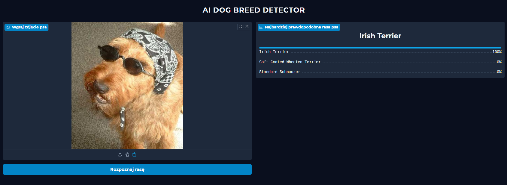

# AI Breed Detector

> Aplikacja oparta na głębokich sieciach neuronowych (CNN), klasyfikująca rasę psa lub jego genetyczną mieszankę na podstawie wgranego zdjęcia. 
> 
> Projekt zrealizowany w ramach przedmiotu **Podstawy Sztucznej Inteligencji** na Akademii Górniczo-Hutniczej (AGH) w Krakowie.

## Wypróbuj aplikację
Model został wdrożony do chmury i posiada przyjazny interfejs graficzny. Możesz przetestować go bezpośrednio w przeglądarce:

👉 **[Uruchom AI Breed Detector na Hugging Face](https://huggingface.co/spaces/adorablemussel/ai-breed-detector)**

---

## Podgląd działania

---

## Stos technologiczny
* **Język:** Python
* **Deep Learning:** PyTorch, Torchvision (Architektura *ConvNeXt*)
* **Interfejs webowy:** Gradio
* **Deployment (CI/CD):** GitHub Actions & Hugging Face Spaces

---

## Zbiór danych (Dataset)
Model został wytrenowany na zbiorze obejmującym 120 unikalnych ras psów. Dane pochodzą z następujących źródeł:
* 🔗 [Kaggle - Stanford Dogs Dataset](https://www.kaggle.com/datasets/jessicali9530/stanford-dogs-dataset/data)
* 🔗 [Stanford Vision Lab - ImageNet Dogs](http://vision.stanford.edu/aditya86/ImageNetDogs/)

---

## Autorzy
* **Szymon Krzysztofik**
* **Tadeusz Kogut**